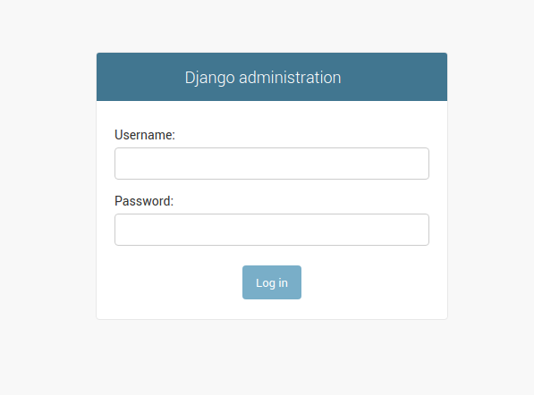
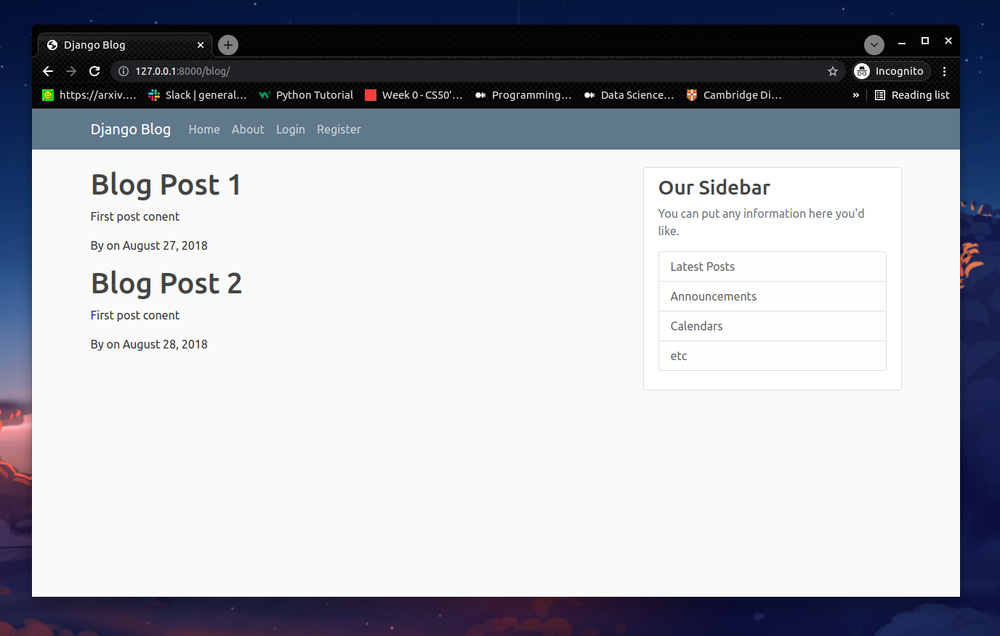
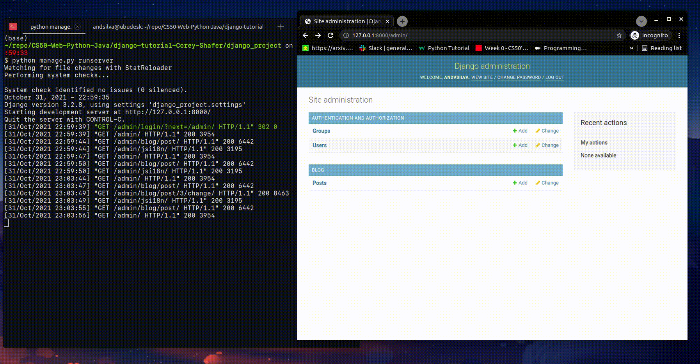

# [Django Tutorial by Corey Schafer - The Best](https://www.youtube.com/watch?v=UmljXZIypDc&list=PL-osiE80TeTtoQCKZ03TU5fNfx2UY6U4p&ab_channel=CoreySchafer)

**Python Django Tutorial: Full-Featured Web App Part 1 - Getting Started**

First, let's to prepare the environment and install the packages to develop the tutorials.

```bash
# create a folder to store the codes
$ take django-tutorial-Corey-Shafer

# An enviromnent
$ sudo apt install python3-venv

# Active the enviromnent  
$ source app-project/bin/activate

## For deactivate just type:
## $ deactivate

## Install packages:

## freeze-requirements
$ pip install freeze-requirements
Collecting freeze-requirements
  Using cached freeze_requirements-0.5.3-py3-none-any.whl
Collecting click
  Downloading click-8.0.3-py3-none-any.whl (97 kB)
     |████████████████████████████████| 97 kB 723 kB/s 
Collecting six
  Downloading six-1.16.0-py2.py3-none-any.whl (11 kB)
Collecting sh
  Using cached sh-1.14.2-py2.py3-none-any.whl (40 kB)
Installing collected packages: six, sh, click, freeze-requirements
Successfully installed click-8.0.3 freeze-requirements-0.5.3 sh-1.14.2 six-1.16.0

## python - Upgrade - pip
$ python3 -m pip install --upgrade pip

Requirement already satisfied: pip in ./app-project/lib/python3.8/site-packages (21.1.1)
Collecting pip
  Downloading pip-21.3.1-py3-none-any.whl (1.7 MB)
     |████████████████████████████████| 1.7 MB 5.1 MB/s 
Installing collected packages: pip
  Attempting uninstall: pip
    Found existing installation: pip 21.1.1
    Uninstalling pip-21.1.1:
      Successfully uninstalled pip-21.1.1
Successfully installed pip-21.3.1

## Install django version 2.1
$ pip install django==2.1            
Collecting django==2.1
  Downloading Django-2.1-py3-none-any.whl (7.3 MB)
     |████████████████████████████████| 7.3 MB 6.4 MB/s            
Collecting pytz
  Downloading pytz-2021.3-py2.py3-none-any.whl (503 kB)
     |████████████████████████████████| 503 kB 5.9 MB/s            
Installing collected packages: pytz, django
Successfully installed django-2.1 pytz-2021.3
(app-project) (base)

## check the version of the django.
$ python -m django --version
2.1

## Install requests
$ pip install requests                                                                                                                 264ms 
Collecting requests
  Downloading requests-2.26.0-py2.py3-none-any.whl (62 kB)
     |████████████████████████████████| 62 kB 123 kB/s             
Collecting charset-normalizer~=2.0.0
  Downloading charset_normalizer-2.0.7-py3-none-any.whl (38 kB)
Collecting idna<4,>=2.5
  Downloading idna-3.3-py3-none-any.whl (61 kB)
     |████████████████████████████████| 61 kB 1.0 MB/s             
Collecting urllib3<1.27,>=1.21.1
  Downloading urllib3-1.26.7-py2.py3-none-any.whl (138 kB)
     |████████████████████████████████| 138 kB 10.9 MB/s            
Collecting certifi>=2017.4.17
  Downloading certifi-2021.10.8-py2.py3-none-any.whl (149 kB)
     |████████████████████████████████| 149 kB 4.8 MB/s            
Installing collected packages: urllib3, idna, charset-normalizer, certifi, requests
Successfully installed certifi-2021.10.8 charset-normalizer-2.0.7 idna-3.3 requests-2.26.0 urllib3-1.26.7
(app-project) (base) 

~/repo/CS50-Web-Python-Java/django-tutorial-Corey-Shafer on  master! ⌚ 11:46:25

$ pip freeze > requirements.txt ## Update in the future if more packages were installed


# The package installed for this project. -> requirement.txt (main folder)

$ pip freeze 
certifi==2021.10.8
charset-normalizer==2.0.7
click==8.0.3
Django==2.1
freeze-requirements==0.5.3
idna==3.3
pytz==2021.3
requests==2.26.0
sh==1.14.2
six==1.16.0
urllib3==1.26.7
(app-project) (base) 

## If you will start to work in this project, you need to 
## the packages listed in requirements.tx

## To install the dependencies for this project
## You just need type on the terminal

$ pip install -r requirements.txt

## Below we have the main command lines to work with django application. See yourself:

## on the terminal:
$ django-admin                                        
Type 'django-admin help <subcommand>' for help on a specific subcommand.

'Available subcommands:'

[django]
    check
    compilemessages
    createcachetable
    dbshell
    diffsettings
    dumpdata
    flush
    inspectdb
    loaddata
    makemessages
    makemigrations
    migrate
    runserver
    sendtestemail
    shell
    showmigrations
    sqlflush
    sqlmigrate
    sqlsequencereset
    squashmigrations
    startapp
    startproject
    test
    testserver
Note that only Django core commands are listed as settings are not properly configured (error: Requested setting INSTALLED_APPS, but settings are not configured. You must either define the environment variable DJANGO_SETTINGS_MODULE or call settings.configure() before accessing settings.).
(app-project) (base) 

## Let's start the project, just type on the terminal:
$ django-admin startproject django_project

# To the file inside the directory project
# cd to the folder django_project and 
# type tree
~/repo/CS50-Web-Python-Java/django-tutorial-Corey-Shafer/django_project on  master! ⌚ 12:05:38
$ tree
.
├── django_project
│   ├── asgi.py
│   ├── __init__.py
│   ├── settings.py
│   ├── urls.py
│   └── wsgi.py
└── manage.py

1 directory, 6 files
(app-project) (base) 

$ python manage.py runserver                                                  
Performing system checks...

System check identified no issues (0 silenced).

You have 15 unapplied migration(s). Your project may not work properly until you apply the migrations for app(s): admin, auth, contenttypes, sessions.
Run 'python manage.py migrate' to apply them.

October 23, 2021 - 15:17:09
Django version 2.1, using settings 'django_project.settings'
Starting development server at http://127.0.0.1:8000/
Quit the server with CONTROL-C.


$ python manage.py migrate

## open the browser and https://127.0.0.1:8000/admin/
```




## Applications and Routes

```bash
# Terminal
$ python manage.py startapp blog

$ tree
.
├── blog
│   ├── admin.py
│   ├── apps.py
│   ├── __init__.py
│   ├── migrations
│   │   ├── __init__.py
│   │   └── __pycache__
│   │       └── __init__.cpython-38.pyc
│   ├── models.py
│   ├── __pycache__
│   │   ├── admin.cpython-38.pyc
│   │   ├── apps.cpython-38.pyc
│   │   ├── __init__.cpython-38.pyc
│   │   ├── models.cpython-38.pyc
│   │   ├── urls.cpython-38.pyc
│   │   └── views.cpython-38.pyc
│   ├── static
│   │   └── blog
│   │       └── main.css
│   ├── templates
│   │   └── blog
│   │       ├── about.html
│   │       ├── base.html
│   │       └── home.html
│   ├── tests.py
│   ├── urls.py
│   └── views.py
├── db.sqlite3
├── django_project
│   ├── asgi.py
│   ├── __init__.py
│   ├── __pycache__
│   │   ├── __init__.cpython-38.pyc
│   │   ├── settings.cpython-38.pyc
│   │   ├── urls.cpython-38.pyc
│   │   └── wsgi.cpython-38.pyc
│   ├── settings.py
│   ├── urls.py
│   └── wsgi.py
└── manage.py

10 directories, 30 files


In the folder:
── templates
│   │   └── blog
│   │       ├── about.html
│   │       ├── base.html
│   │       └── home.html

# see the 3 files -> pages

# style for the page:
static
│   │   └── blog
│   │       └── main.css

## open in the browser:
## http://127.0.0.1:8000/blog/
```



```bash
### Add the code below to the file home.html

<article class="media content-section">
  <div class="media-body">
    <div class="article-metadata">
      <a class="mr-2" href="#">{{ post.author }}</a>
      <small class="text-muted">{{ post.date_posted }}</small>
    </div>
      <h2><a class="article-title" href="#">{{ post.title }}</a></h2>
      <p class="article-content">{{ post.content }}</p>
  </div>
</article>

### file home.html


    
        <article class="media content-section">
            <div class="media-body">
            <div class="article-metadata">
                <a class="mr-2" href="#">{{ post.author }}</a>
                <small class="text-muted">{{ post.date_posted }}</small>
            </div>
                <h2><a class="article-title" href="#">{{ post.title }}</a></h2>
                <p class="article-content">{{ post.content }}</p>
            </div>
        </article>
    

```

```bash
$ python manage.py makemigrations                                  
No changes detected

$ python manage.py migrate
Operations to perform:
  Apply all migrations: admin, auth, contenttypes, sessions
Running migrations:
  No migrations to apply.

$ python manage.py createsuperuser 
Username (leave blank to use 'andsilva'): andvsilva
Email address: andsilvadrcc@gmail.com
Password: 
Password (again): 
Superuser created successfully.
```


```bash
### Python Django Tutorial: Full-Featured Web App Part 5 - Database and Migrations
### Added class Post file models.py

$ python manage.py makemigrations  
Migrations for 'blog':
  blog/migrations/0001_initial.py
    - Create model Post


#########################################################################
# File blog/migrations/0001_initial.py
# Generated by Django 3.2.8 on 2021-10-31 22:00

from django.conf import settings
from django.db import migrations, models
import django.db.models.deletion
import django.utils.timezone


class Migration(migrations.Migration):

    initial = True

    dependencies = [
        migrations.swappable_dependency(settings.AUTH_USER_MODEL),
    ]

    operations = [
        migrations.CreateModel(
            name='Post',
            fields=[
                ('id', models.BigAutoField(auto_created=True, primary_key=True, serialize=False, verbose_name='ID')),
                ('title', models.CharField(max_length=100)),
                ('content', models.TextField()),
                ('date_posted', models.DateTimeField(default=django.utils.timezone.now)),
                ('author', models.ForeignKey(on_delete=django.db.models.deletion.CASCADE, to=settings.AUTH_USER_MODEL)),
            ],
        ),
    ]

#########################################################################

# create the database
$ python manage.py sqlmigrate blog 0001                                                       571ms 
BEGIN;
--
-- Create model Post
--
CREATE TABLE "blog_post" ("id" integer NOT NULL PRIMARY KEY AUTOINCREMENT, "title" varchar(100) NOT NULL, "content" text NOT NULL, "date_posted" datetime NOT NULL, "author_id" integer NOT NULL REFERENCES "auth_user" ("id") DEFERRABLE INITIALLY DEFERRED);
CREATE INDEX "blog_post_author_id_dd7a8485" ON "blog_post" ("author_id");
COMMIT;

and 'migrate'. # change on the database.

$ python manage.py migrate 
Operations to perform:
  Apply all migrations: admin, auth, blog, contenttypes, sessions
Running migrations:
  Applying blog.0001_initial... OK

## Shell 
$ python manage.py shell
Python 3.8.11 (default, Aug  3 2021, 15:09:35) 
Type 'copyright', 'credits' or 'license' for more information
IPython 7.27.0 -- An enhanced Interactive Python. Type '?' for help.

In [1]: from blog.models import Post

In [2]: from django.contrib.auth.models import User

In [3]: User.objects.all()
Out[3]: <QuerySet [<User: andvsilva>]>

In [4]: User.objects.first()
Out[4]: <User: andvsilva>

In [5]: User.objects.filter(username='andvsilva')
Out[5]: <QuerySet [<User: andvsilva>]>

In [6]: User.objects.filter(username='andvsilva').first()
Out[6]: <User: andvsilva>

In [7]: user = User.objects.filter(username='andvsilva').first()

In [8]: user
Out[8]: <User: andvsilva>

In [9]: user.id
Out[9]: 1

In [10]: user.pk
Out[10]: 1

In [11]: user = User.objects.get(id=1)

In [12]: user
Out[12]: <User: andvsilva>

In [13]: Post.objects.all()
Out[13]: <QuerySet []>

In [14]: post_1 = Post(title='Blog 1', content='First Post Content', author=user)

In [15]: Post.objects.all()
Out[15]: <QuerySet []>

In [16]: post_1.save()

In [17]: Post.objects.all()
Out[17]: <QuerySet [<Post: Post object (1)>]>

In [18]: exit()

### Now we need to add a 'method' in the file models.py

    def __str__(self):
        return self.title

## and run shell again
$ python manage.py shell                                                                   994068ms 
Python 3.8.11 (default, Aug  3 2021, 15:09:35) 
Type 'copyright', 'credits' or 'license' for more information
IPython 7.27.0 -- An enhanced Interactive Python. Type '?' for help.

In [1]: from blog.models import Post

In [2]: from django.contrib.auth.models import User

In [3]: Post.objects.all()
Out[3]: <QuerySet [<Post: Blog 1>]>

In [4]: user = User.objects.filter(username='andvsilva').first()

In [5]: user
Out[5]: <User: andvsilva>

In [6]: post_2 = Post(title='Blog 2', content='Second Post Content!', author_id=user.id)

In [7]: post_2.save()

In [8]: Post.objects.all()
Out[8]: <QuerySet [<Post: Blog 1>, <Post: Blog 2>]>

In [10]: post = Post.objects.first()

In [11]: post.content
Out[11]: 'First Post Content'

In [12]: post.date_posted
Out[12]: datetime.datetime(2021, 10, 31, 22, 21, 33, 481134, tzinfo=<UTC>)

In [13]: post.author
Out[13]: <User: andvsilva>

In [14]: post.author.email
Out[14]: 'andsilvadrcc@gmail.com'

In [15]: user
Out[15]: <User: andvsilva>

In [16]: user.post_set
Out[16]: <django.db.models.fields.related_descriptors.create_reverse_many_to_one_manager.<locals>.RelatedManager at 0x7f681e91cac0>

In [17]: user.post_set.all
Out[17]: <bound method BaseManager.all of <django.db.models.fields.related_descriptors.create_reverse_many_to_one_manager.<locals>.RelatedManager object at 0x7f681dea1d00>>

In [18]: user.post_set.all()
Out[18]: <QuerySet [<Post: Blog 1>, <Post: Blog 2>]>

In [19]: user.post_set.create(title='Blog 3', content='Third Post Content!')
Out[19]: <Post: Blog 3>

In [20]: Post.objects.all()
Out[20]: <QuerySet [<Post: Blog 1>, <Post: Blog 2>, <Post: Blog 3>]>

In [21]: exit()
```

```bash
## Change the context to Query Post from database. File views.py
## --> 'posts': Post.objects.all() # Query.
from .models import Post

# Create your views here.
def home(request):
    context = {
        'posts': Post.objects.all() # Query.
    }
    return render(request, 'blog/home.html', context)

def about(request):
    return render(request, 'blog/about.html', {'title': 'About'})

## Add the line below in the file 'admin.py'
from .models import Post

admin.site.register(Post)

```

And the posts...



## Users App

```bash
$ python manage.py startapp users

# Browser:
http://127.0.0.1:8000/register/
```


## Resources

- [Django Basics for a Beginner](https://medium.com/@humble_bee/django-basics-for-a-beginner-5d864e6aa084)
- [Build fast, responsive sites with Bootstrap](https://getbootstrap.com/)