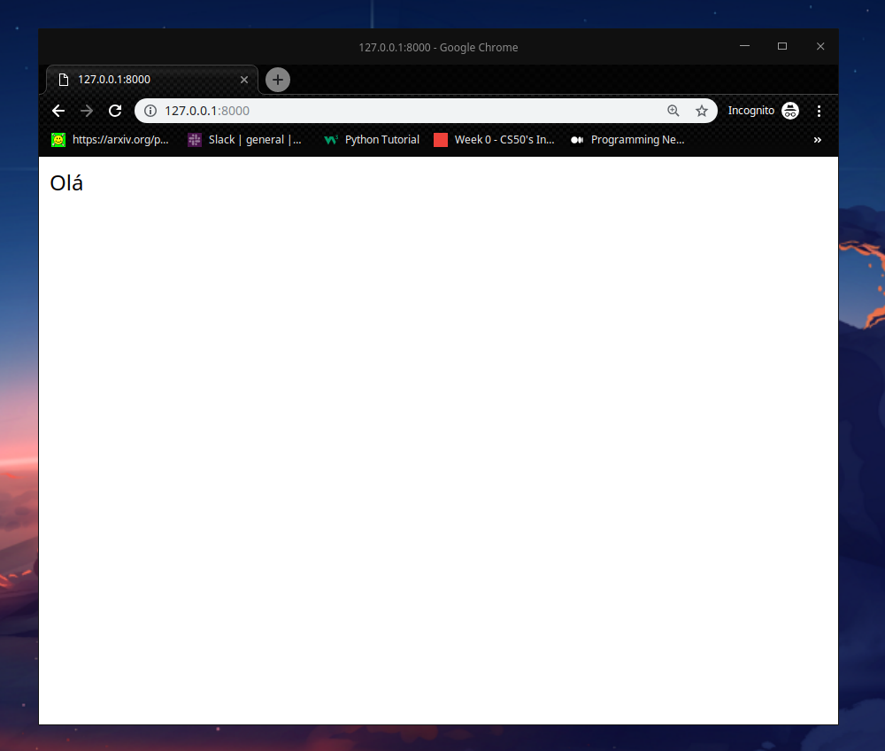
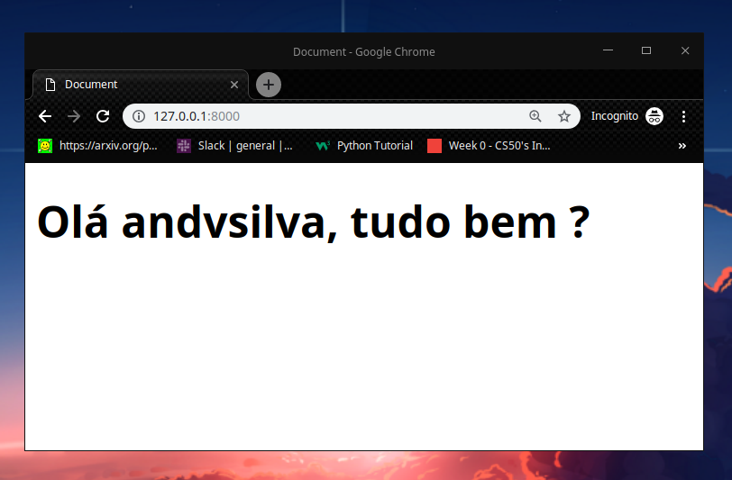

## Django Application

We will develop a complete system delivery using ```python``` and ```django```.


First, we need to set the virtual environment to run own app.

```bash
# terminal
python3 -m venv venv
```

and now we have to active the virtual environment to install the libraries to this project.

```Bash
#LINUX
source venv/bin/activate
```

After the virtual environment active, we will install the libraries

```bash
# terminal
pip install django pillow
```

Now we need to create a base structure for this project [Django](https://www.djangoproject.com/start/), i.e. we should use

```bash
# terminal
django-admin startproject imersaoPython .
```

After this, we need to create the APP's in which will be divide in own application, let's run the command:

```bash
python3 manage.py startapp produto
```

Now inside the folder ```imersaoPython``` we have a file [settings.py](/imersaoPython/settings.py) and let us to define in this file some configurations that the majority of the Django projects have to use.

let us to create the APP produto:

```bash
cd django
python manage.py startapp produto
```

and also create the files: [urls.py](produto/urls.py) 

```bash
# file: produto/urls.py
from django.urls import path
from . import views

urlpatterns = [
    path("", views.home, name='home'),
]
```
and [urls.py](imersaoPython/urls.py):

```bash
# file: imersaoPython/urls.py
# imersaoPython URL Configuration
from django.contrib import admin
from django.urls import path, include
from django.conf import settings
from django.conf.urls.static import static

urlpatterns = [
    path('admin/', admin.site.urls),
    path('', include('produto.urls')),
]
urlpatterns += static(settings.STATIC_URL, document_root=settings.STATIC_ROOT)
urlpatterns += static(settings.MEDIA_URL, document_root=settings.MEDIA_ROOT)
```

Therefore, we need to create a function home inside of the file [views.py](produto/views.py) that we are done to call.

```bash
# file: produto/views.py
from django.shortcuts import render
from django.http import HttpResponse
# Create your views here.

def home(requests):
    return HttpResponse('Olá')
```

Done this, now we have to execute the command:

```bash
python3 manage.py runserver
```

```bash
Watching for file changes with StatReloader
Performing system checks...

System check identified no issues (0 silenced).

You have 18 unapplied migration(s). Your project may not work properly until you apply the migrations for app(s): admin, auth, contenttypes, sessions.
Run 'python manage.py migrate' to apply them.
July 05, 2021 - 15:14:10
Django version 3.2.5, using settings 'imersaoPython.settings'
Starting development server at http://127.0.0.1:8000/
```



**Ola** is not a html file, to render html page, we are going to create one directory inside our APP product and inside him we can create our file html:

```bash
# file: produto/templates/home.html
<!DOCTYPE html>
<html lang="en">
<head>
    <meta charset="UTF-8">
    <meta http-equiv="X-UA-Compatible" content="IE=edge">
    <meta name="viewport" content="width=device-width, initial-scale=1.0">
    <title>Document</title>
</head>
<body>
    <h1>Olá {{nome}}, tudo bem ?</h1>
</body>
</html>
```

```bash
# file: produtos/views.py
from django.shortcuts import render
from django.http import HttpResponse

def home(request):
    return render(request, 'home.html', {'nome': 'andvsilva'})
```




### resources

- [Django documentation](https://docs.djangoproject.com/en/3.2/)