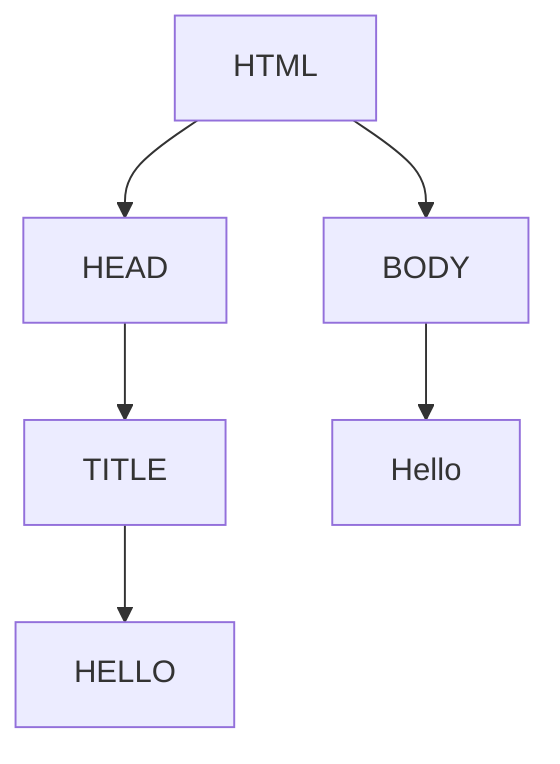

# Lecture 0 - HTML and CSS

To start, I will show a basic example to describe the structure a webpage and explain the some details.

#### [webpage.html](webpage.html):

```bash
<!DOCTYPE html>
<!-- It is an information to the browser about the document type to expert -->

<html lang="en">
<!-- type of language: english -->

<head>
    <!-- Head of the page-->
    <meta charset="UTF-8">
    <meta name="viewport" content="width=device-width, initial-scale=1.0">
    <title>HELLO</title>
    <!-- Title of the wepage-->
</head>

<body>
    <!-- Body of the webpage-->
    Hello.
</body>

</html>
<!-- end webpage-->
```

```bash
# To open this page in a web browser type in the terminal:
$ google-chrome webpage.html 
```

### Document Object Model:

A diagram to describe the webpage:



In the folder lecture 0 we have basic examples of how to make (personal reference):

- [form](html/form.html)
- [formcolors](html/formcolors.html)
- [image](html/image.html)
- [link](html/link.html)
- [lists](html/lists.html)
- [heading](html/heading.html)
- [table](html/table.html)

## Useful References:

- [Lecture - HTML and CSS](https://cs50.harvard.edu/web/2020/notes/0/#:~:text=HTML%20and%20CSS)
- [HTML](https://www.w3schools.com/html/), [CSS](https://www.w3schools.com/css/)
