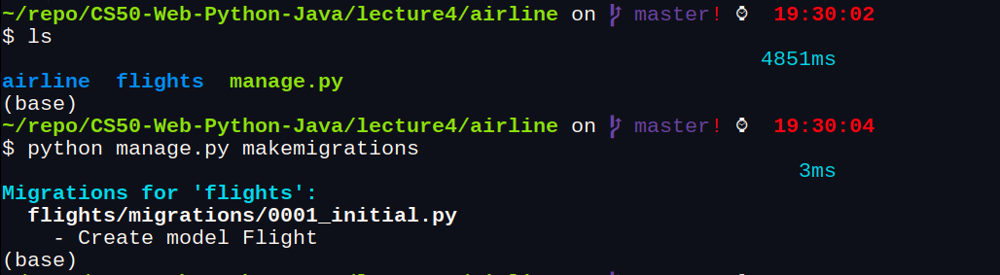
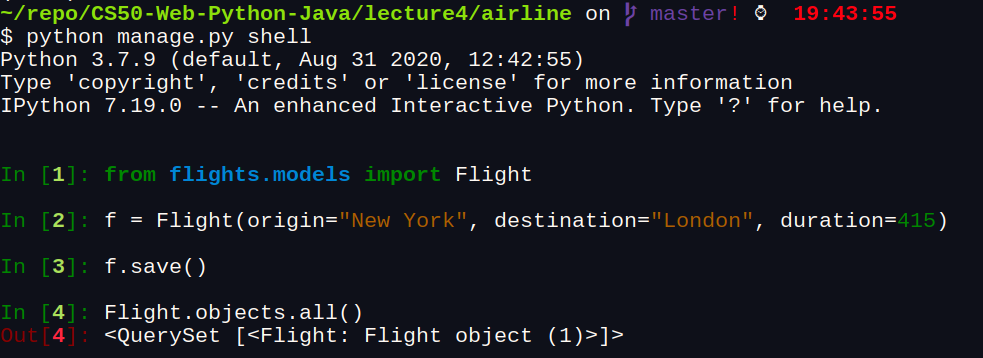
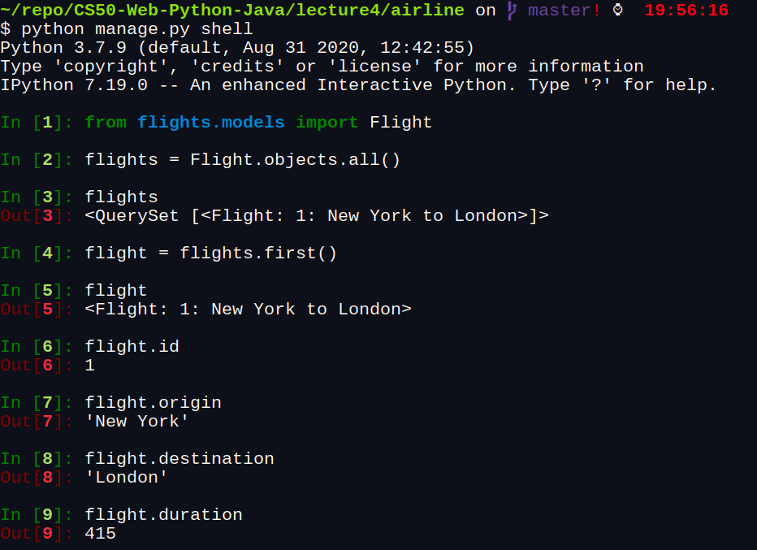

# [Lecture 4 - SQL, Models, and Migrations](https://cs50.harvard.edu/web/2020/weeks/4/)

[SQL](https://dev.mysql.com/doc/), or Structured Query Language, is a programming language that allows us to update and query databases.

## Database

Before we get into how to use the SQL language, we should discuss how our data is stored. When using SQL, we’ll work with a [relational database](https://www.oracle.com/database/what-is-a-relational-database/#:~:text=A%20relational%20database%20is%20a,of%20representing%20data%20in%20tables) where we can find all of our data stored in a number of tables. Each of these tables is made up of a set number of columns and a flexible number of rows.

To illustrate how to work with SQL, we’ll use the example of a website for an airline used to keep track of flights and passengers. In the following table, we see that we’re keeping track of a number of flights, each of which has an origin, a destination, and a duration.

There are several different relational database management systems that are commonly used to store information, and that can easily interact with SQL commands:

- [MySQL](https://www.mysql.com/)
- [PostgreSQL](https://www.postgresql.org/)
- [SQLite](https://www.sqlite.org/index.html)

## SQLite3

```bash
## terminal
## To install
$ sudo apt-get install sqlite3 libsqlite3-dev

## This a basic example to show the main METHODS - SQL
# create file sql
~/repo/CS50-Web-Python-Java/lecture4/data
$ touch flights.sql

# open sqlite3 file flights
~/repo/CS50-Web-Python-Java/lecture4/data
$ sqlite3 flights.sql                                      
SQLite version 3.33.0 2020-08-14 13:23:32
Enter ".help" for usage hints.
sqlite> CREATE TABLE flights (
   ...> id INTEGER PRIMARY KEY AUTOINCREMENT,
   ...> origin TEXT NOT NULL,
   ...> destination TEXT NOT NULL,
   ...> duration INTEGER NOT NULL
   ...> );

# Listing all current tables (Just flights for now)
sqlite> .tables
flights

# Querying for everything within flights (Which is now empty)
sqlite> SELECT * FROM flights;

# Adding one flight
sqlite> INSERT INTO flights (origin, destination, duration) VALUES ("New York", "London", 415);

# Checking for new information, which we can now see
sqlite> SELECT * FROM flights;
1|New York|London|415

# Adding some more flights
sqlite> INSERT INTO flights (origin, destination, duration) VALUES ("Shanghai", "Paris", 760);
sqlite> INSERT INTO flights (origin, destination, duration) VALUES ("Istanbul", "Tokyo", 700);
sqlite> INSERT INTO flights (origin, destination, duration) VALUES ("New York", "Paris", 435);
sqlite> INSERT INTO flights (origin, destination, duration) VALUES ("Moscow", "Paris", 245);
sqlite> INSERT INTO flights (origin, destination, duration) VALUES ("Lima", "New York", 455);

# Querying this new information
sqlite> SELECT * FROM flights;
1|New York|London|415
2|Shanghai|Paris|760
3|Istanbul|Tokyo|700
4|New York|Paris|435
5|Moscow|Paris|245
6|Lima|New York|455

# Changing the settings to make output more readable
sqlite> .mode columns
sqlite> .headers yes
sqlite> SELECT * FROM flights;
id  origin    destination  duration
--  --------  -----------  --------
1   New York  London       415     
2   Shanghai  Paris        760     
3   Istanbul  Tokyo        700     
4   New York  Paris        435     
5   Moscow    Paris        245     
6   Lima      New York     455 

sqlite> SELECT * FROM flights WHERE origin = "New York";
id  origin    destination  duration
--  --------  -----------  --------
1   New York  London       415     
4   New York  Paris        435

# We can also use more than just equality to filter out 
# our flights. For integer and real values, we can use 
# greater than or less than:
sqlite> SELECT * FROM flights WHERE duration > 500;
id  origin    destination  duration
--  --------  -----------  --------
2   Shanghai  Paris        760     
3   Istanbul  Tokyo        700

# And we can also use other logic (AND, OR) like in Python:
## SQL AND, OR and NOT Operators: 
## https://www.w3schools.com/sql/sql_and_or.asp
sqlite> SELECT * FROM flights WHERE duration > 500 AND destination = "Paris";
id  origin    destination  duration
--  --------  -----------  --------
2   Shanghai  Paris        760

sqlite> SELECT * FROM flights WHERE duration > 500 OR destination = "Paris";
id  origin    destination  duration
--  --------  -----------  --------
2   Shanghai  Paris        760     
3   Istanbul  Tokyo        700     
4   New York  Paris        435     
5   Moscow    Paris        245

# We can also use the keyword IN to see if a bit of data 
# is one of several options:

sqlite> SELECT * FROM flights WHERE origin IN ("New York", "Lima");
id  origin    destination  duration
--  --------  -----------  --------
1   New York  London       415     
4   New York  Paris        435     
6   Lima      New York     455  

# We can even use regular expressions to search words more 
# broadly using the LIKE keyword. The below query finds all 
# results with an a in the origin, by using % as a wildcard
# character.

sqlite> SELECT * FROM flights WHERE origin LIKE "%a%";
id  origin    destination  duration
--  --------  -----------  --------
2   Shanghai  Paris        760     
3   Istanbul  Tokyo        700     
6   Lima      New York     455
```

## Functions

There are also a number of SQL functions we can apply to the results of a query. These can be useful if we don’t need all of the data returned by a query, but just some summary statistics of the data.

- [AVERAGE](https://www.w3schools.com/sql/sql_count_avg_sum.asp)
- [COUNT](https://www.w3schools.com/sql/sql_count_avg_sum.asp)
- [MAX](https://www.w3schools.com/sql/sql_count_avg_sum.asp)
- [MIN](https://www.w3schools.com/sql/sql_count_avg_sum.asp)
- [SUM](https://www.w3schools.com/sql/sql_count_avg_sum.asp)
- [...](https://www.w3schools.com/sql/sql_count_avg_sum.asp)

### [UPDATE](https://www.w3schools.com/sql/sql_update.asp)
we may also want to be able update rows of a table that already exist.

```bash
sqlite> SELECT * FROM flights;
id  origin    destination  duration
--  --------  -----------  --------
1   New York  London       415     
2   Shanghai  Paris        760     
3   Istanbul  Tokyo        700     
4   New York  Paris        435     
5   Moscow    Paris        245     
6   Lima      New York     455

# update table a new information
sqlite> UPDATE flights
   ...>     SET duration = 430
   ...>     WHERE origin = "New York"
   ...>     AND destination = "London";

sqlite> SELECT * FROM flights;
id  origin    destination  duration
--  --------  -----------  --------
1   New York  London       430    # new info add  
2   Shanghai  Paris        760     
3   Istanbul  Tokyo        700     
4   New York  Paris        435     
5   Moscow    Paris        245     
6   Lima      New York     455
```

### [DELETE](https://www.w3schools.com/sql/sql_delete.asp)

```bash
sqlite> SELECT * FROM flights;
id  origin    destination  duration
--  --------  -----------  --------
1   New York  London       430     
2   Shanghai  Paris        760     
3   Istanbul  Tokyo        700     
4   New York  Paris        435     
5   Moscow    Paris        245     
6   Lima      New York     455

# delete row
sqlite> DELETE FROM flights WHERE destination = "Tokyo";

sqlite> SELECT * FROM flights;
id  origin    destination  duration
--  --------  -----------  --------
1   New York  London       430     
2   Shanghai  Paris        760     
4   New York  Paris        435     
5   Moscow    Paris        245     
6   Lima      New York     455
```

### Other Clauses

There are a number of additional clauses we can use to control queries coming back to us

- [LIMIT](https://www.w3schools.com/sql/sql_top.asp): Limits the number of results returned by a query
- [ORDER BY](https://www.w3schools.com/sql/sql_orderby.asp): Orders the results based on a specified column
- [GROUP BY](https://www.w3schools.com/sql/sql_groupby.asp): Groups results by a specified column
- [HAVING](https://www.w3schools.com/sql/sql_having.asp): Allows for additional constraints based on the number of results

### Joining Tables
- A [FOREIGN KEY](https://www.w3schools.com/sql/sql_foreignkey.asp) is a key used to link two tables together.

### JOIN Query
  - [JOIN](https://www.w3schools.com/sql/sql_join.asp)

### Django Models

[Django Models](https://docs.djangoproject.com/en/3.0/topics/db/models/) are a level of [abstraction](https://techterms.com/definition/abstraction) on top of SQL that allow us to work with databases using Python classes and objects rather than direct SQL queries.

Let’s get started on using models by creating a django project for our airline, and creating an app within that project

```bash
~/repo/CS50-Web-Python-Java/lecture4
$ django-admin startproject airline

~/repo/CS50-Web-Python-Java/lecture4/airline
$ python manage.py startapp flights

```

Now we’ll have to go through the process of adding an app as usual:

1. Add ```flights``` to the ```INSTALLED_APPS``` list in ```settings.py```
2. Add a route for ```flights``` in ```urls.py```:

```bash
### urls.py
path("flights/", include("flights.urls")),
```

1. Create a ```urls.py``` file within the ```flights``` application. And fill it with standard ```urls.py``` imports and lists.

Now, rather than creating actual paths and getting started on ```views.py```, we’ll create some models in the ```models.py``` file. In this file, we’ll outline what data we want to store in our application. Then, Django will determine the SQL syntax necessary to store information on each of our models. Let’s take a look at what a model for a single flight might look like:

```bash
class Flight(models.Model):
    origin = models.CharField(max_length=64)
    destination = models.CharField(max_length=64)
    duration = models.IntegerField()

```

Let’s take a look at what’s going on in this model definition:

- In the first line, we create a new model that **extends** Django’s model class.
- Below, we add fields for origin, destination, and duration. The first two are [Char Fields](https://docs.djangoproject.com/en/3.0/ref/forms/fields/#charfield), meaning they store strings, and the third is an [Integer Field](https://docs.djangoproject.com/en/3.0/ref/forms/fields/#integerfield). These are just two of many [built-in Django Field classes](https://docs.djangoproject.com/en/3.0/ref/forms/fields/#built-in-field-classes)
- We specify maximum lengths of 64 for the two Character Fields. you can check the specifications available for a given field by checking the [documentation](https://docs.djangoproject.com/en/3.0/ref/forms/fields/#built-in-field-classes).


### Migrations

Now, even though we’ve created a model, we do not yet have a database to store this information to create a database from our models, we navigate to the main directory of our project and run the command.

```bash
# terminal 
$ python manage.py makemigrations
```

This command creates some Python files that will create or edit our database to be able to store what we have in our models. You should get an output that looks something like the one below, and if you navigate to your migrations directory, you’ll notice a new file was created for us



Next, to apply these migrations to our database, we run the command

```bash
python manage.py migrate
```

Now, you’ll see some default migrations have been applied along with our own, and you’ll also notice that we now have a file called db.sqlite3 in our project’s directory


```bash
~/repo/CS50-Web-Python-Java/lecture4/airline
$ ls                                                                          3218ms 
airline  db.sqlite3  flights  manage.py

```

### Shell

Now, to begin working adding information to and manipulating this database, we can enter Django’s shell where we can run Python commands within our project.

```Bash
## terminal
$ python manage.py shell                                                         3ms 
Python 3.7.9 (default, Aug 31 2020, 12:42:55) 
Type 'copyright', 'credits' or 'license' for more information
IPython 7.19.0 -- An enhanced Interactive Python. Type '?' for help.

```

```bash
# Import our flight model
In [1]: from flights.models import Flight

# Create a new flight
In [2]: f = Flight(origin="New York", destination="London", duration=415)

# Instert that flight into our database
In [3]: f.save()

# Query for all flights stored in the database
In [4]: Flight.objects.all()
Out[4]: <QuerySet [<Flight: Flight object (1)>]>
```



When we query our database, we see that we get just one flight called Flight object (1). This isn’t a very informative name, but we can fix that. Inside models.py, we’ll define a __str__ function that provides instructions for how to turn a Flight object into a string:

```Bash
class Flight(models.Model):
    origin = models.CharField(max_length=64)
    destination = models.CharField(max_length=64)
    duration = models.IntegerField()

    def __str__(self):
        return f"{self.id}: {self.origin} to {self.destination}"
```

Now, when we go back to the shell, our output is a bit more readable:

```bash
# Create a variable called flights to store the results of a query
In [7]: flights = Flight.objects.all()

# Displaying all flights
In [8]: flights
Out[8]: <QuerySet [<Flight: 1: New York to London>]>

# Isolating just the first flight
In [9]: flight = flights.first()

# Printing flight information
In [10]: flight
Out[10]: <Flight: 1: New York to London>

# Display flight id
In [11]: flight.id
Out[11]: 1

# Display flight origin
In [12]: flight.origin
Out[12]: 'New York'

# Display flight destination
In [13]: flight.destination
Out[13]: 'London'

# Display flight duration
In [14]: flight.duration
Out[14]: 415
```



This is a good start, but thinking back to earlier, we don’t want to have to store the city name as an origin and destination for every flight, so we probably want another model for an airport that is somehow related to the flight model:

## Useful References

- [SQL Tutorial](https://www.w3schools.com/sql/)
